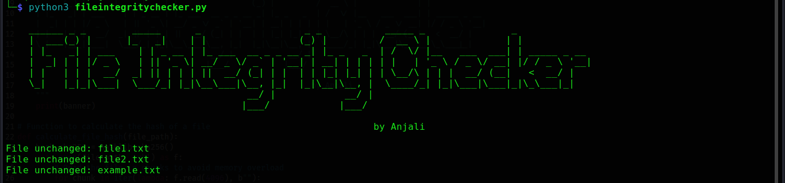

# File-Integrity-Checker
A Python-based tool to monitor file integrity by calculating and comparing hash values (e.g., SHA-256). This tool helps detect unauthorized changes, modifications, or deletions of files, ensuring the integrity of critical system or application files.

## Introduction
The File Integrity Checker is a simple but effective Python script that monitors files by calculating their hash values (using SHA-256) and comparing these hashes over time. If any file is modified, added, or deleted, the tool alerts the user about the change. This tool can be used for detecting unauthorized file modifications, ensuring data integrity, and complying with security standards in various environments.

## Features
Detects modifications in files by comparing hash values.
Tracks new, modified, and unchanged files.
Stores the hash values in a persistent file for future comparisons.
Easy-to-use and customizable for different files and directories.
Supports integration into automated monitoring or alerting systems.

## Installation
Clone the repository:

    git clone https://github.com/yourusername/file-integrity-checker.git
    cd file-integrity-checker

Install Python dependencies: Ensure you have Python 3 installed. If not, download and install Python 3.
Then, install any necessary libraries:

    pip install hashlib
    
## Usage
Edit the files_to_monitor list: Open fileintegritychecker.py and specify the files you wish to monitor. Example:

    files_to_monitor = ["/path/to/file1.txt", "/path/to/file2.txt"]
Run the script: Execute the Python script to start monitoring files:

    python3 fileintegritychecker.py
The script will calculate the hash of the specified files and compare them to stored hash values. If any changes are detected, it will display a message indicating which files were modified, added, or remain unchanged.

## How It Works
The script takes a list of file paths (files_to_monitor) and calculates their SHA-256 hash values.
The hash values are saved in a file (file_hashes.pkl), which will be used for comparison on subsequent runs.
On each run, the script calculates the current hash values of the files and compares them with the previously stored hash values:
If a file is modified, it will alert the user.
If a new file is detected, it will alert the user.
If a file remains unchanged, it will confirm that the file's integrity is intact.
After comparing, the script updates the stored hash values for future comparisons.

## License
This project is licensed under the MIT License - see the LICENSE file for details.

## Preview Image

Here’s a screenshot of the project:

